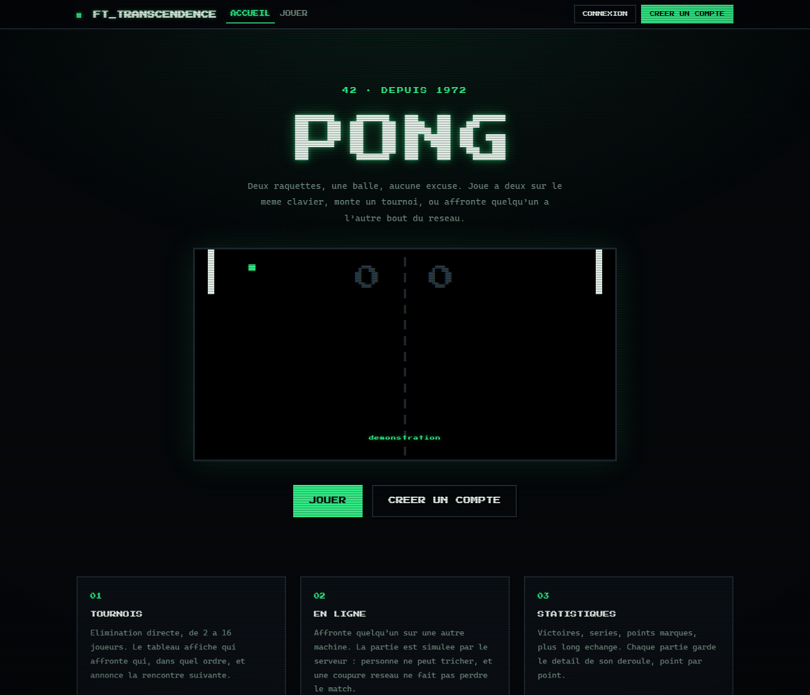
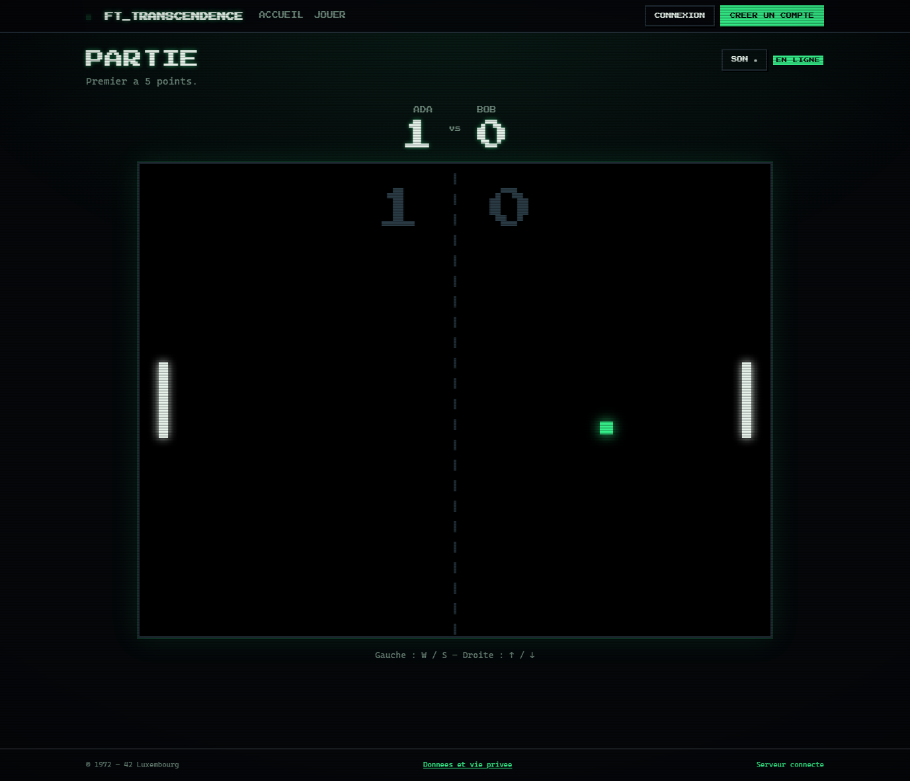

# ft_transcendence

Dernier projet du tronc commun de l'ecole 42.

Un site web pour jouer a Pong.

## Ce que le site permet

Deux personnes jouent une partie sur le meme clavier. L'une utilise les touches
W et S, l'autre les fleches haut et bas. La premiere a atteindre le score
choisi gagne.

Un tournoi oppose de 2 a 16 joueurs en elimination directe. Chacun saisit son
alias au demarrage. Le tableau indique les rencontres et leur ordre, et annonce
la suivante a mesure que les matchs se terminent.

Avec un compte, une partie peut se jouer a distance, chaque joueur sur sa
machine. Un compte donne egalement acces a un profil, a une liste d'amis avec
leur statut de connexion, a une messagerie directe et a l'historique des
parties jouees.

Les statistiques regroupent les victoires, les defaites, les points marques et
le deroule detaille de chaque partie.

## Documentation

- [Installation et exploitation](docs/installation.md)
- [Couverture du sujet](docs/modules.md)
- [Choix techniques](docs/decisions.md)
- [Checklist d'evaluation](docs/eval-checklist.md)
